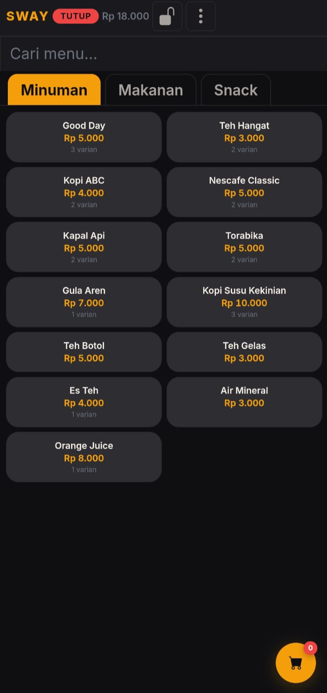
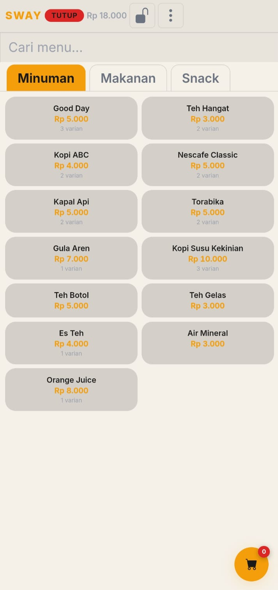
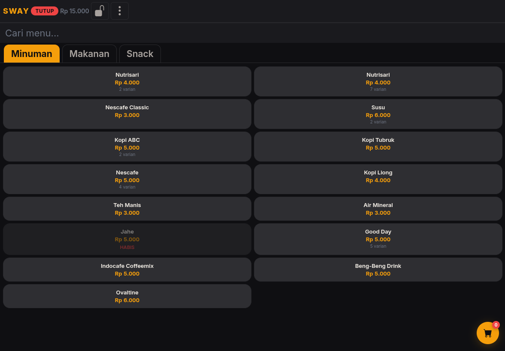
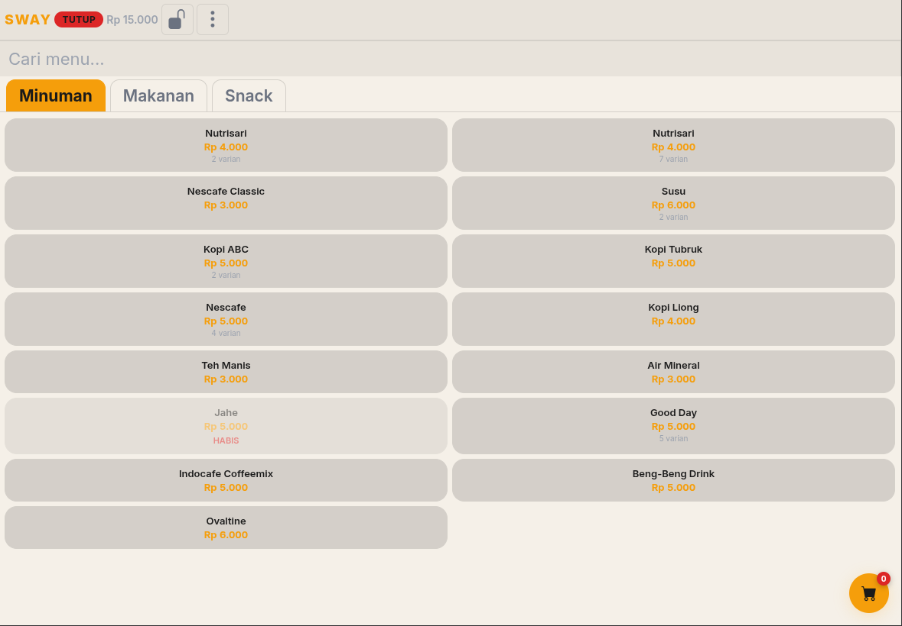

  <picture>
    <source media="(prefers-color-scheme: dark)" srcset="icons/icon-512.png">
    
  </picture>

<h1 align="center">SWAY POS</h1>

  <strong>Kasir Modern untuk Warkop Indonesia</strong>
   
  <em>Modern Point-of-Sale for Indonesian Coffee Shops</em>

 

  
  
  
  
  

 

---

 

  
  &nbsp;
  

 

<strong>🇮🇩 Bahasa Indonesia</strong>

 

SWAY POS adalah sistem kasir modern untuk **warung kopi, rumah makan, dan usaha kecil** di Indonesia. **100% offline** — tanpa internet, tanpa server, tanpa langganan bulanan.

 

### ✨ Fitur

| | | |
|---|---|---|
| **📋 Manajemen Menu** — Kategori, varian, add-on, stok | **🛒 Keranjang Cerdas** — Multi-item, catatan per-item |
| **💳 Pembayaran Cepat** — Tunai & QRIS, hitung kembalian | **📊 Sistem Shift** — Buka/tutup warung, rekap harian |
| **📌 Open Bill** — Bayar sebagian, split payment | **👥 Makan Karyawan** — Catat konsumsi terpisah |
| **📒 Buku Kas** — Modal awal, kas keluar, riwayat | **🔒 Panel Admin** — PIN proteksi, kelola data |
| **📈 Dashboard** — Omzet, grafik 7 hari, PPN | **💾 Backup & Restore** — Export CSV, backup data |

### ⭐ Premium

| Fitur | Free | Premium |
|-------|------|---------|
| Menu | max 15 item | tanpa batas |
| Admin Panel | menu only | full akses |
| Open Bill | ❌ | ✅ |
| Backup Data | ❌ | ✅ |
| Laporan | ❌ | ✅ |
| Trial 7 hari | ✅ gratis | — |
| Aktivasi kode | — | M1/M3/M6/Y1 |

### 🛠 Tech Stack

| Lapisan | Teknologi |
|---------|-----------|
| UI | HTML + CSS + JavaScript (vanilla) |
| Database | IndexedDB (offline-first) |
| Android | WebView wrapper (APK mandiri) |
| Mode | Tablet landscape & HP portrait |

### 📸 Tampilan

  
  &nbsp;&nbsp;
  

  
  &nbsp;&nbsp;
  

### 📄 Lisensi

**Perangkat lunak proprietary.** Hak cipta dilindungi undang-undang. Repositori ini publik untuk tujuan demonstrasi. Kode sumber **tidak open source** — tidak boleh disalin, dimodifikasi, didistribusikan, atau digunakan tanpa izin tertulis.

 

---

 

<strong>🇬🇧 English</strong>

 

SWAY POS is a modern POS system for **Indonesian coffee shops, food stalls, and small restaurants**. **100% offline** — no internet, no server, no monthly subscription.

 

### ✨ Features

| | | |
|---|---|---|
| **📋 Menu Management** — Categories, variants, add-ons, stock | **🛒 Smart Cart** — Multi-item, per-item notes |
| **💳 Quick Payment** — Cash & QRIS, auto change | **📊 Shift System** — Open/close, daily recap |
| **📌 Open Bill** — Partial payment, split bill | **👥 Employee Meal** — Separate consumption log |
| **📒 Cash Ledger** — Float, expenses, history | **🔒 Admin Panel** — PIN-protected management |
| **📈 Dashboard** — Daily omzet, 7-day chart | **💾 Backup & Restore** — CSV export, data restore |

### ⭐ Premium

| Feature | Free | Premium |
|---------|------|---------|
| Menu items | max 15 | unlimited |
| Admin Panel | menu only | full access |
| Open Bill | ❌ | ✅ |
| Backup Data | ❌ | ✅ |
| Reports | ❌ | ✅ |
| 7-day free trial | ✅ | — |
| Activation codes | — | M1/M3/M6/Y1 |

### 🛠 Tech Stack

| Layer | Technology |
|-------|------------|
| UI | HTML + CSS + JavaScript (vanilla) |
| Database | IndexedDB (offline-first) |
| Android | WebView wrapper (standalone APK) |
| Display | Tablet landscape & phone portrait |

### 📸 Screenshots

  
  &nbsp;&nbsp;
  

  
  &nbsp;&nbsp;
  

### 📄 License

**Proprietary software.** All rights reserved. This repository is public for demonstration purposes only. Source code is **not open source** — may not be copied, modified, distributed, or used without explicit written permission.

 

---

  &copy; 2026 SWAY POS. All rights reserved.

